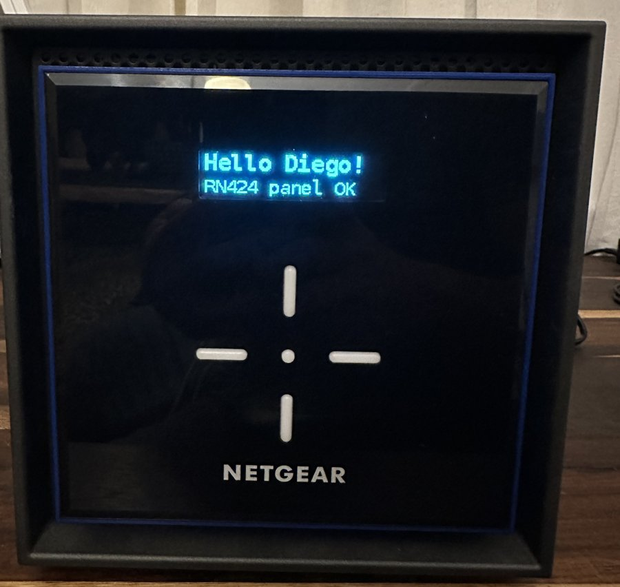

# ReadyNAS RN424 → OpenMediaVault

NETGEAR has discontinued the ReadyNAS line and ReadyNAS OS 6 is stuck on Debian
8. The hardware is still good. This repo turns a **ReadyNAS 424** into an
**OpenMediaVault 8** NAS, keeps the data already on its drives, and makes the
front display and buttons work again.

| | |
|---|---|
| **[GUIDE.md](GUIDE.md)** | Full step-by-step conversion: replacement USB DOM, headless install from a Windows PC, serial console, network, importing an existing ReadyNAS volume, SMB. |
| **[panel/](panel/)** | Front-panel driver: status pages on the display, 5-way buttons, RAID/disk-full alerts. |
| **[docs/PINMAP.md](docs/PINMAP.md)** | How the RN424 display pins were recovered from NETGEAR's kernel, plus the pin tables for the RN316, 42x, 516/716, 524–628. |
| **[tools/dump_pinmap.py](tools/dump_pinmap.py)** | Prints those tables from any ReadyNAS OS 6 `kernel` file. |

## Status

| | Tested |
|---|---|
| Hardware | ReadyNAS 424, BIOS "ReadyNAS 424 V3.11" |
| OS | OpenMediaVault 8.3.1 (Debian 13), kernels 6.12 and 7.2 |
| Boot device | 8 GB 9-pin USB DOM (HGST/STEC) on the internal header |
| Data | Existing ReadyNAS OS 6 volume (mdadm + btrfs), mounted unchanged |
| Front panel | Display and all five buttons working |

The RN422 shares the RN424's board and pin map and should work the same way,
but hasn't been tested. The panel driver also carries the RN426/RN428 pin map.

## Quick overview

1. Install OMV into a VirtualBox VM on a 6.8 GB virtual disk.
2. Inside the VM, add a catch-all DHCP config, enable the serial console, put
   all storage drivers in the initramfs, disable swap.
3. Convert the VM disk to a raw image and flash it to the new DOM with Etcher.
4. Swap the DOM into the NAS, boot with the serial console (rear **UART**
   micro-USB, 115200 8N1) attached, find the IP.
5. Finish setup in the web UI, install omv-extras + writecache, mount the
   existing `md127` btrfs volume, share it over SMB.
6. Install the front-panel service.

## Credits

* [riplatt/truenas-rn426-panel](https://github.com/riplatt/truenas-rn426-panel)
  – the original RN426 front-panel reverse engineering this builds on.
* The NETGEAR Community forum members who documented the DOM, the UART
  console and alternative-OS installs on ReadyNAS hardware.
* NETGEAR's GPL kernel for ReadyNAS OS 6, from which the pin map was read.

## Disclaimer

Not affiliated with or endorsed by NETGEAR. You're modifying hardware that
holds your data; back up first and keep the original DOM untouched so you can
go back. The panel driver writes SoC GPIO registers directly – read
[panel/README.md](panel/README.md#safety) before running it. MIT licence, no
warranty.
